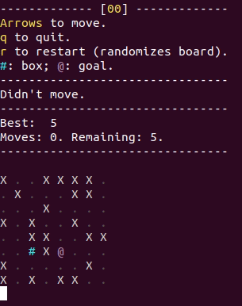

# Sokoban puzzle generator

Library and executables aimed at generating solvable and interesting Sokoban boards.
To play a round:

```sh
cargo run --bin game <board-size>
```



This was done as a training exercise to learn Rust. Feedback welcome!